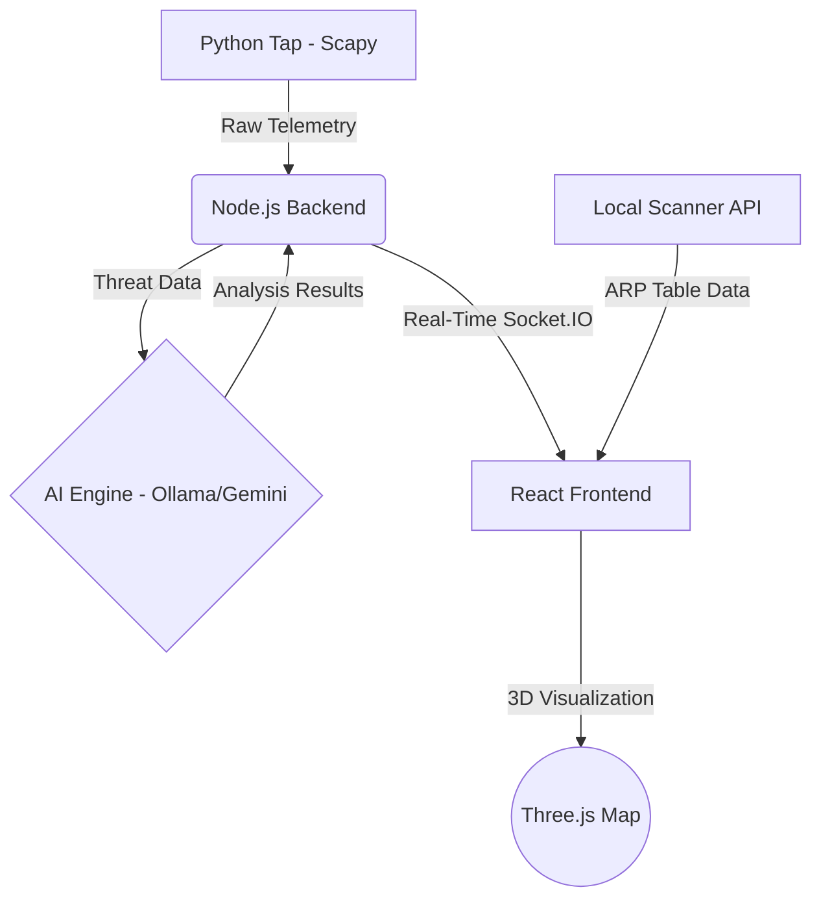
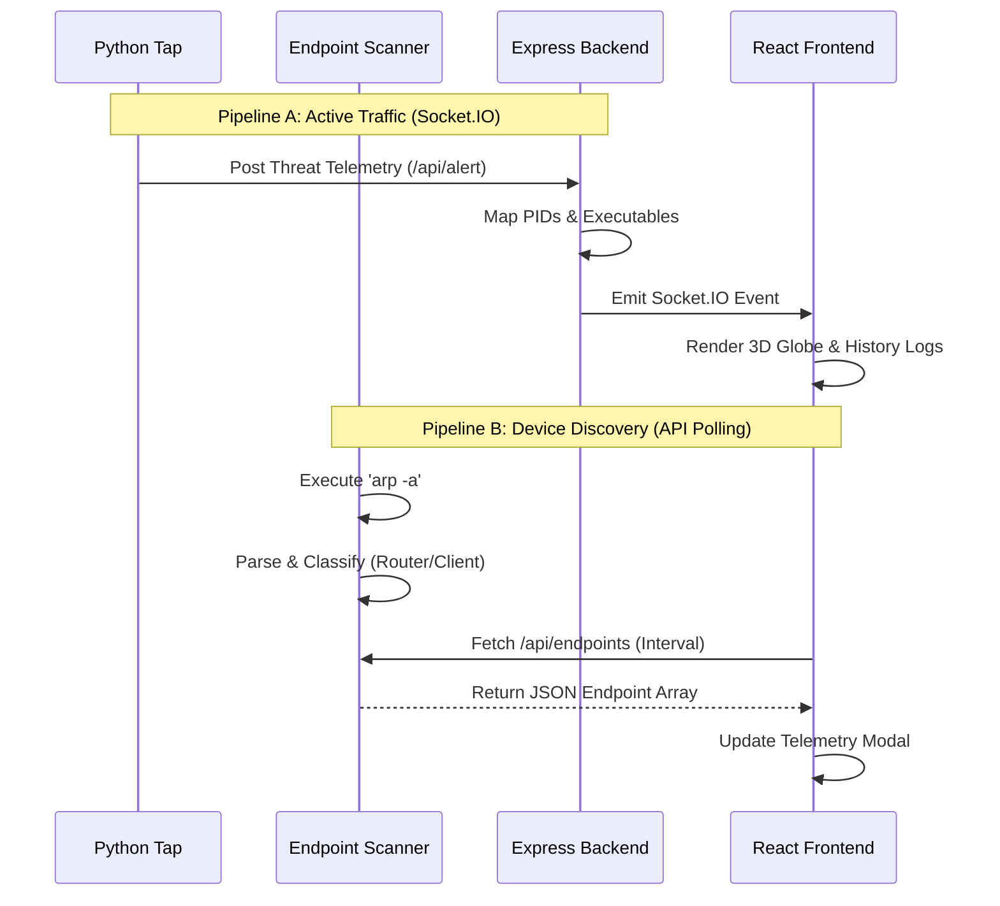

# Software Requirements Specification (SRS) for NetGuard Bharat
Developed by: Prasad Prashant Dabhekar

## 1. Introduction

### Purpose
The purpose of this document is to outline the software requirements for NetGuard Bharat, a real-time network threat detection and monitoring system. This document serves as the official technical specification for NetGuard Bharat, describing its architecture, system requirements, design, and planned future enhancements.

### Scope
NetGuard Bharat focuses on monitoring network traffic, using AI-assisted threat analysis, and providing a 3D visualization dashboard. It captures telemetry, analyzes payloads, geofences connections, and presents the data through a web interface to help users identify potential threats.

### Objectives
- Monitor outbound socket connections in real time
- Visualize traffic on a 3D globe
- Detect suspicious telemetry patterns
- Provide AI-assisted threat summaries
- Export structured threat reports
- Build a modular cybersecurity research platform

### Supported Platforms
- Windows 10/11 (Current)
- Linux (Planned)

### Overview
The system captures raw network packets using a Python tap, processes the telemetry, and forwards it to an AI engine (using Ollama and Gemini) for basic pattern matching and payload summaries. A Node.js backend handles socket communication, delivering real-time updates to a React frontend that uses Three.js for geospatial mapping.

---

## 2. System Architecture

The architecture of NetGuard Bharat is divided into several loosely coupled, scalable components:

- **Frontend**: A dynamic, responsive React application built with Three.js to provide 3D geospatial mapping and telemetry visualization.
- **Backend**: A Node.js and Express server that manages API requests, socket connections, and system orchestration.
- **Local Scanner API**: A standalone Node.js server that reads the Windows ARP table to identify dynamically connected local endpoints.
- **Python Tap**: A dedicated packet-sniffing component using Scapy to capture live network traffic, extract telemetry, and filter out noise.
- **AI Engine**: Integrated with Ollama (local models) and Gemini (cloud capabilities) to provide heuristic summaries and basic payload evaluation.
- **Socket Communication**: Uses Socket.IO to maintain low-latency, bidirectional real-time data streaming from the tap to the frontend dashboard.

### Architecture Diagram

---

## 3. Functional Requirements

- **Real-time Socket Monitoring**: The system must establish and maintain live socket connections to stream network telemetry with sub-second latency.
- **Endpoint Discovery**: The system must scan the local network ARP table to discover, validate, and track dynamic host endpoints via an isolated API, supported by aggressive frontend polling (3-second intervals) to maintain precise real-time synchronization.
- **AI Threat Analysis**: The system must evaluate packet payloads, highlight suspicious text strings, and generate summaries using AI models.
- **PDF Generation**: The system must provide a capability to export threat analysis reports and system summaries in PDF format for offline review.
- **Geofencing**: The system must cross-reference IP addresses to filter, allow, or block traffic based on geographic boundaries.
- **Telemetry Visualization**: The system must visually represent network nodes, connections, and threat levels on an interactive global map.

---

## 4. Non-Functional Requirements

- **Performance**: The Python tap must process high-throughput network traffic without dropping critical packets.
- **Scalability**: The backend must support multiple simultaneous client connections and scale horizontally if traffic load increases.
- **Security**: Future versions will include authenticated API access and encrypted socket communication.
- **Low Latency**: End-to-end latency from packet capture to UI visualization must remain under 100ms for optimal real-time monitoring.
- **Reliability**: The system should feature auto-recovery mechanisms for the Python tap and Socket.IO connections in case of failure.

---

## 5. Technology Stack

- **Frontend**: React, Three.js, CSS
- **Backend**: Node.js, Express.js
- **Real-time Communication**: Socket.IO
- **Network Capture**: Python, Scapy
- **AI Integration**: Ollama (Local AI), Gemini (Advanced Cloud AI)

---

## 6. Data Flow

The system operates using a Two-Brain Architecture to ensure safe, high-performance data interception without bottlenecks:

### Pipeline A: Real-Time Sockets (Active Traffic)
1. **Capture**: The Python tap sniffs packets from the network interface.
2. **Extraction**: Relevant metadata (Source/Dest IP, Ports, Protocol, Payload size) is extracted.
3. **Transmission**: The Python tap pushes telemetry to the Node.js backend via API `/api/alert`.
4. **Enrichment**: The backend maps active sockets to processes via `netstat` and `tasklist`.
5. **Broadcasting**: The enriched telemetry is broadcasted via Socket.IO to connected frontend clients.
6. **Rendering**: The React frontend updates its state, plotting the new data points onto the Three.js 3D globe.

### Pipeline B: API Polling (Endpoint Discovery)
1. **ARP Polling**: A dedicated Local Network Scanner API (`endpoint_server.js`) runs `arp -a` commands on the host machine.
2. **Filtering**: The output is parsed to extract dynamic IPv4 addresses and MAC addresses.
3. **Classification**: Devices are classified as Infrastructure (Routers/Gateways) or Clients.
4. **Aggressive Fetching**: The React frontend aggressively polls this API every 3 seconds, entirely replacing state memory so disconnected endpoints are instantly removed from the UI.

### Two-Brain Flow Diagram

---

## 7. Threat Detection Logic

- **Payload Threshold Logic**: Packets exceeding predefined size limits or containing unusual byte patterns trigger immediate alerts.
- **Heuristic Pattern Matching**: AI models review payload text against known suspicious patterns to flag potential issues.
- **Filters**: Static rules engines drop known safe traffic (e.g., standard DNS queries to trusted servers) to reduce AI processing overhead and focus on high-risk payloads.

---

## 8. Known Challenges

- Real-time packet processing introduces CPU overhead.
- GeoIP lookup accuracy varies by provider.
- Browser rendering load increases with excessive globe arcs.
- Packet capture requires elevated system privileges.

---

## 9. Current Limitations

- Currently optimized for Windows environments.
- Uses polling via netstat instead of kernel-level hooks.
- AI threat analysis is heuristic-assisted and not production trained.
- GeoIP accuracy depends on third-party datasets.
- Packet inspection depth is intentionally limited for performance.

---

## 10. Future Scope

The architecture is designed to accommodate expansions in the future:
- **ML Behavioral Analysis**: Moving beyond static payloads to analyzing the sequential behavior of network sessions over time.
- **Container Monitoring**: Deploying specialized taps as sidecars in Kubernetes to monitor microservice-to-microservice (east-west) traffic.
- **SIEM Integration**: Exporting threat data to Security Information and Event Management systems.
- **Linux Support**: Deepening the Python tap's capabilities using eBPF for zero-copy, kernel-level packet inspection on Linux.
- **Distributed Agents**: Deploying multiple taps across remote branches, all feeding into a centralized dashboard.

---

## 11. Conclusion

NetGuard Bharat is designed as a real-time network monitoring and threat visualization system focused on outbound traffic analysis. By combining basic packet analysis with heuristic machine learning and 3D visualization, it helps users identify and understand potential threats. The modular architecture provides a solid foundation for adding new analysis techniques as the project evolves.

